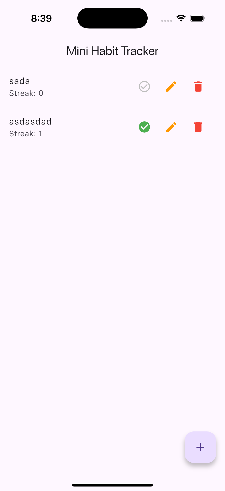
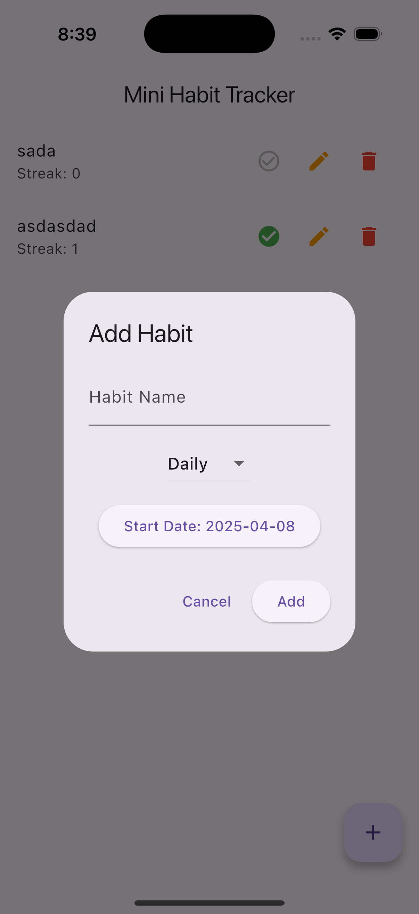
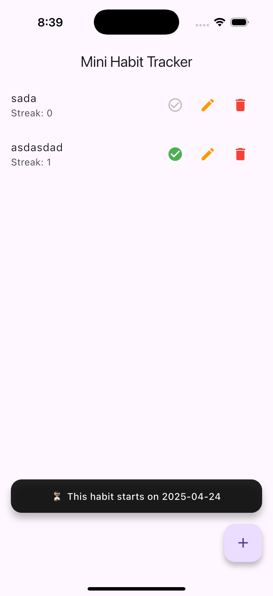
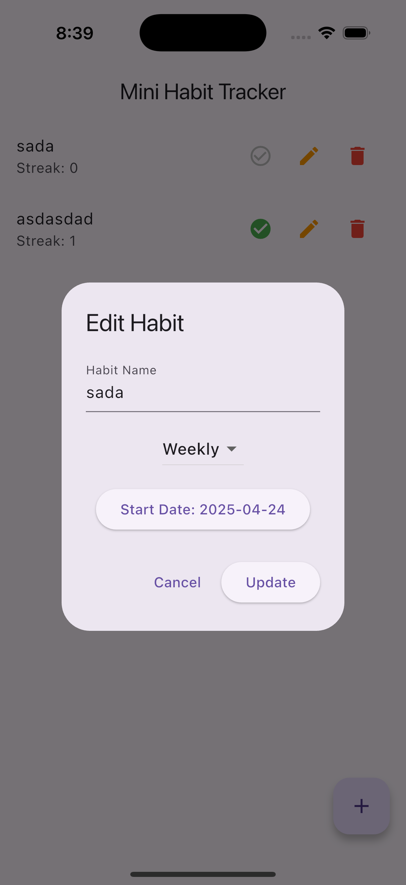

# 🧠 Mini Habit Tracker App

A clean and minimal Flutter app to help you build and track daily or weekly habits.  
Built with **Bloc**, **Firebase Firestore**, and **clean architecture** principles.

---

## 📱 Screenshots

| Home Screen | Add Habit | Snackbar | Edit Habit |
|-------------|-----------|----------|------------|
|  |  |  |  |

---

## ✨ Features

- ✅ Add Daily or Weekly habits
- ✅ Track current streak with completion status
- ✅ Edit existing habits with pre-filled modal
- ✅ Delete habits with a single tap
- ✅ Streak increases when marked complete
- ✅ Beautiful floating Instagram-style snackbars
- ✅ Firestore for real-time sync
- ✅ Clean architecture using Bloc pattern

---

## 🧱 Project Architecture
lib/
├── core/
│   └── utils/                    # (optional: helpers, constants)
│       └── snackbar_util.dart      
├── data/
│   ├── models/
│   │   └── habit_model.dart
│   └── repositories/
│       └── habit_repository_impl.dart
├── domain/
│   ├── entities/
│   │   └── habit_entity.dart
│   └── repositories/
│       └── habit_repository.dart
├── presentation/
│   ├── bloc/
│   │   ├── habit_bloc.dart
│   │   ├── habit_event.dart
│   │   └── habit_state.dart
│   ├── screens/
│   │   └── home_screen.dart
│   ├── widgets/
│   │   └── add_habit_dialog.dart
│   └── routes/
│       └── app_router.dart
├── firebase_options.dart          # generated by flutterfire configure
└── main.dart


---

## 🚀 Getting Started

### 1. Clone the repository

```bash
git clone https://github.com/sinit0607/mini-habit-tracker.git

cd mini-habit-tracker

flutter pub get

Setup Firebase

===> Create a Firebase project at https://console.firebase.google.com

===> Add google-services.json (Android) and GoogleService-Info.plist (iOS) to their respective directories

===> Run:flutterfire configure

===> flutter run


📦 Dependencies: 

===> flutter_bloc

===> firebase_core

===> cloud_firestore

===> uuid

===> intl

===> provider

===> equatable


